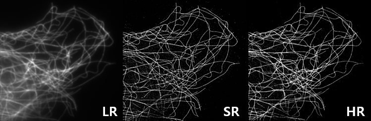
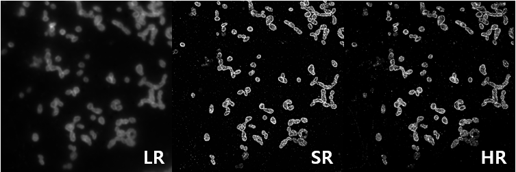

# AI-driven_STORM
> **Official Release:** **June 25, 2026**
### Sample Image




This repository is based on the following paper: **"ResShift: Efficient Diffusion Model for Image Super-resolution by Residual Shifting"**.

Please also cite the original [paper](https://github.com/zsyOAOA/ResShift) when using or developing this notebook.

# 1. System Requirements

AI-driven_STORM was tested on Windows OS with Python 3.10 installed.

Conda (Anaconda or Miniconda) is required to create and manage the Python environment.

For both training and testing, at least one GPU is required, and CPU-only execution is not supported. The required GPU memory may vary depending on the input image size.

For testing with **1024 × 1024** images, at least **11 GB of GPU memory** is required.

During training, the required GPU memory depends on the selected batch size.

If you experience difficulties installing Conda, a step-by-step **Miniconda installation guide** is provided below.

# 2. Installation Guide

To install AI-driven_STORM, make sure that **Python 3.10** is installed.

First, clone the GitHub repository and move to the project directory:

```bash
git clone https://github.com/DDingHan/AI-driven_STORM.git
cd AI-driven_STORM
```

After downloading the repository and entering the project directory, install the AI-driven_STORM environment using one of the following methods.

### Option 1: Create a Conda environment manually

```bash
conda create -n AI-driven_STORM python=3.10 -y
conda activate AI-driven_STORM
pip install -r requirements.txt
```

### Option 2: Use the provided environment file

```bash
conda env create -f environment.yml
conda activate AI-driven_STORM
```

Typical installation time is approximately **20 minutes**.

# 3. Demo

Below is a brief guide on how to test and train AI-driven_STORM using sample or experimental data.

## 3.1 Testing

Run the following command according to the target organelle type (`tubule` or `mito`).

```bash
python demo.py -i [image folder/image path] -o [result folder] --type [tubule/mito]
```

For example, to test the **tubule** model:

```bash
python demo.py -i sample/tubule -o result/tubule --type tubule
```

When the command is executed for the first time, the required pretrained models will be downloaded automatically.

After testing is completed, the reconstructed results will be saved in the specified **result folder**.


## 3.2 Training

### Step I: Prepare Dataset

Before training, prepare paired **LR/HR datasets**.

If LR and HR images have different spatial sizes, resize or crop them first so that both images have the same dimensions.

Example dataset structure:

```text
dataset/
├── train/
│   ├── LR/
│   │   ├── 0001.png
│   │   ├── 0002.png
│   │   └── ...
│   └── HR/
│       ├── 0001.png
│       ├── 0002.png
│       └── ...
├── val/
│   ├── LR/
│   └── HR/
└── test/
    ├── LR/
    └── HR/
```

Paired LR and HR images should share **identical filenames**.

### Step II: Download Pre-trained Weights

Download the pre-trained VQGAN model from the following link and place it inside the `weights` folder:

[VQGAN Pre-trained Weights](https://github.com/DDingHan/AI-driven_STORM/releases/tag/v1.0)

### Step III: Adjust Configuration

Open `config.yaml` and modify the following settings:

**a.** Open the `config.yaml` file.

**b.** Around line **78**, set:

* `dir_path` → path to `dataset/train/LR`
* `dir_path_extra` → path to `dataset/train/HR`

**c.** Around line **93**, set the validation dataset paths in the same way using the `val` dataset.

**d.** Around line **113**, adjust `batch` and `microbatch` according to your available GPU memory.

* `configs.train.batch`: `[training batch size, validation batch size]`
* `configs.train.microbatch`: `training batch size / number of GPUs`

### Step III (Optional): Quick Start with Sample Dataset

For a quick training example, we provide a prepared sample dataset:

```text
sample_tubule_dataset/
```

This sample dataset is already configured for training.

Therefore, no modification of config.yaml is required.


### Step IV: Train the Model

Specify the GPUs to use and the number of GPUs in the command below.

For example, to train using **GPU 0 and 1**:

* Specify GPU IDs in `CUDA_VISIBLE_DEVICES`
* Specify the number of GPUs in `--nproc_per_node`

```bash
CUDA_VISIBLE_DEVICES=0,1 torchrun --standalone --nproc_per_node=2 --nnodes=1 main.py --cfg_path config.yaml
```

### Step V: Test a Trained Model

After training is completed:

**a.** Select the desired checkpoint from:

```text
save_dir/[training folder]/ema_ckpt/
```

**b.** Copy the checkpoint file to the `weights` folder and rename it.

For example:

```text
test_model.pth
```

**c.** Run testing using the following command:

```bash
python demo.py -i sample/tubule -o result/tubule --type tubule --ckpt weights/test_model.pth
```

---

## Miniconda Installation (Optional)

If Conda is not already installed on your system, install **Miniconda** first.

### Windows

1. Download the Miniconda installer from the official website:
   https://www.anaconda.com/download/success

2. Run the installer and complete the installation.

3. Open **Anaconda Prompt** or **Command Prompt**.

4. Verify the installation:

```bash id="nmkv7v"
conda --version
```

### Linux (SSH / Server)

Download the Miniconda installer:

```bash id="jg8vwf"
wget https://repo.anaconda.com/miniconda/Miniconda3-latest-Linux-x86_64.sh
```

Run the installer:

```bash id="mjlwmh"
bash Miniconda3-latest-Linux-x86_64.sh
```

Follow the installation process and type `yes` when prompted.

Initialize Conda:

```bash id="wqks3g"
~/miniconda3/bin/conda init bash
source ~/.bashrc
```

Verify installation:

```bash id="i6x34g"
conda --version
```

If a **Conda Terms of Service (ToS)** error occurs, accept the required channels:

```bash id="x4l5du"
conda tos accept --override-channels --channel https://repo.anaconda.com/pkgs/main
conda tos accept --override-channels --channel https://repo.anaconda.com/pkgs/r
```

Then create the environment:

```bash id="gcld7k"
conda create -n AI-driven_STORM python=3.10 -y
conda activate AI-driven_STORM
```


## License

This project is licensed under <a rel="license" href="https://github.com/sczhou/CodeFormer/blob/master/LICENSE">NTU S-Lab License 1.0</a>. Redistribution and use should follow this license.

## Acknowledgement

This project is based on [Improved Diffusion Model](https://github.com/openai/improved-diffusion), [LDM](https://github.com/CompVis/latent-diffusion), and [BasicSR](https://github.com/XPixelGroup/BasicSR). We also adopt [Real-ESRGAN](https://github.com/xinntao/Real-ESRGAN) to synthesize the training data for real-world super-resolution. Thanks for their awesome works.

### Contact
If you have any questions, please feel free to contact me via `ko990415@naver.com`.


